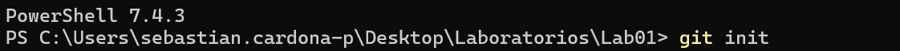
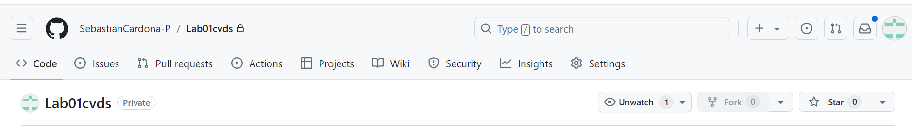
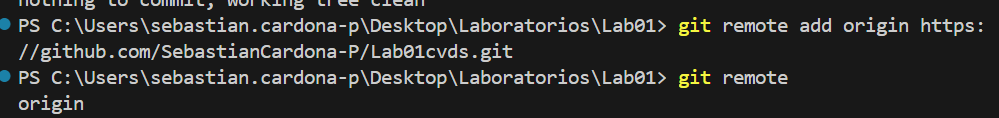
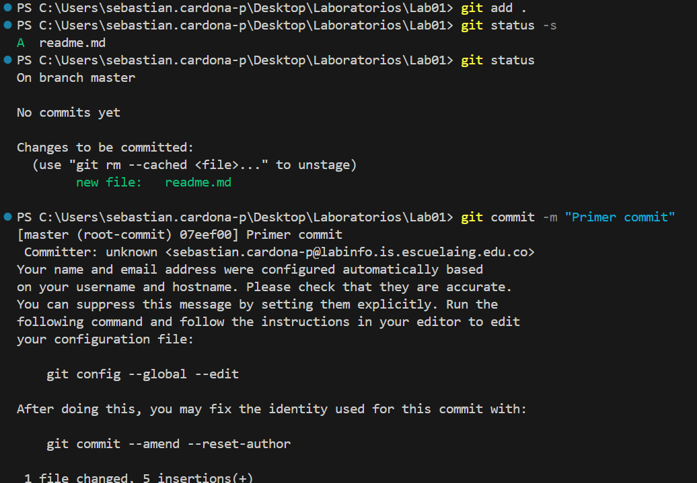
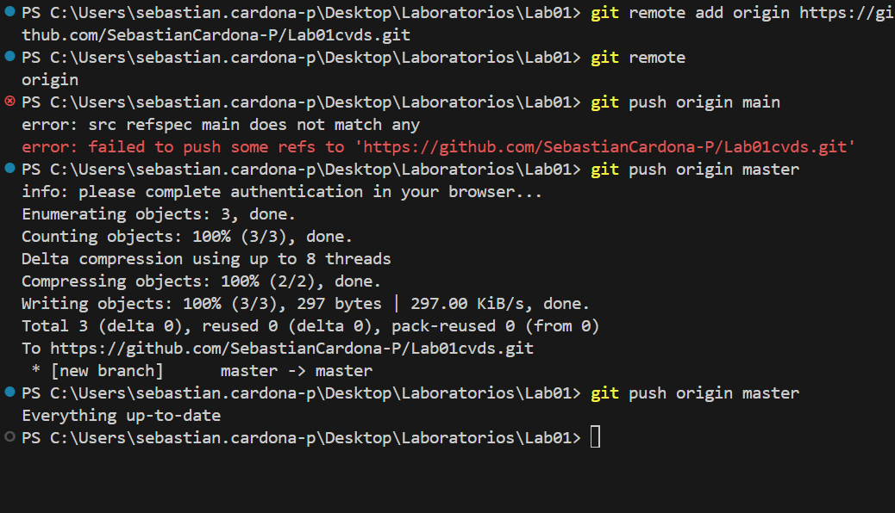

# Laboratorio 1

## Sebastian Cardona Parra

Primera parte individual

1.

2.
archivo readme.md creado

3.
el git add sirve para mover los cambios del directorio de trabajo al entorno para su confirmacion

git commit cpatura la instacia de cambios preparados en un momento dado del proyecto

4.
Hecho

5.
Repositorio en github creado

6.

7.

